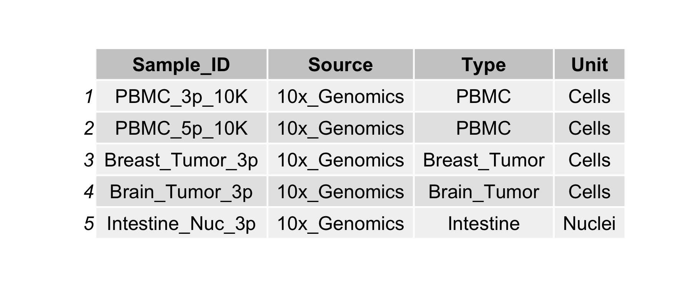
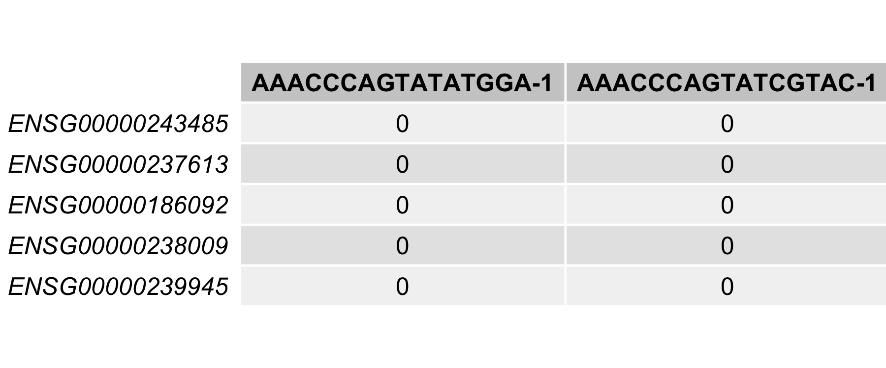

***

# **scdata**
An R package for quickly loading pre-processed single-cell (sc) RNA-Seq data for downstream experimentation. The *scdata* package contains a library of public scRNA-Seq data and code required to update that library as needed.

***

## Installation

Clone the 'scprep' repository
```
git clone https://github.com/g-duclos/scprep.git
```

Run R and install the package
```
install.packages("scprep", repos=NULL, type="source")
```


## Getting Started

#### View Available Data

```
library(scdata)

# Load MetaData
data(scdata_metadata, package="scdata")

# View available package data
print(scdata_metadata)

```


***

#### Load Example Data

```
library(scdata)

# Load scRNA-Seq Data
data(PBMC_3p_10K, package="scdata")

# View the 1st 5 rows and 2 columns
print(PBMC_3p_10K[1:5, 1:2])

```



